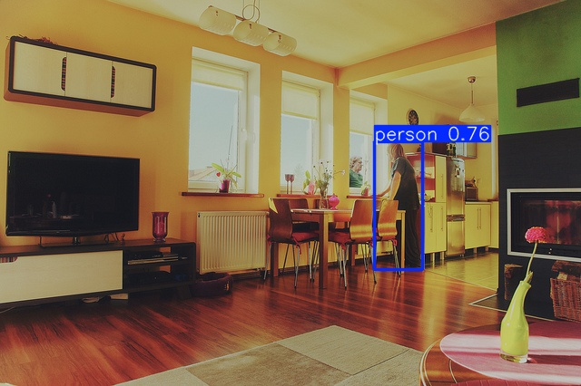
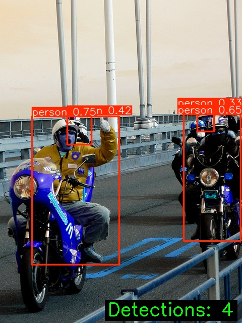
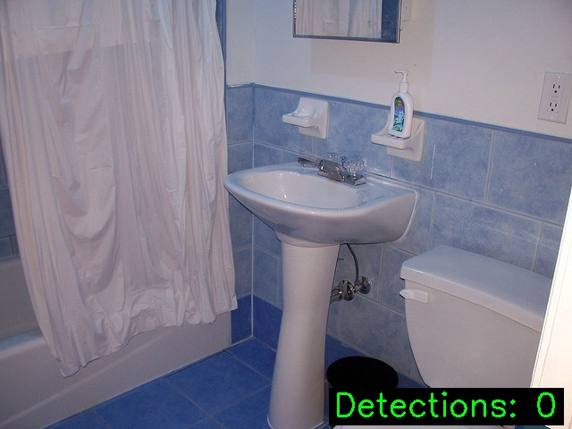
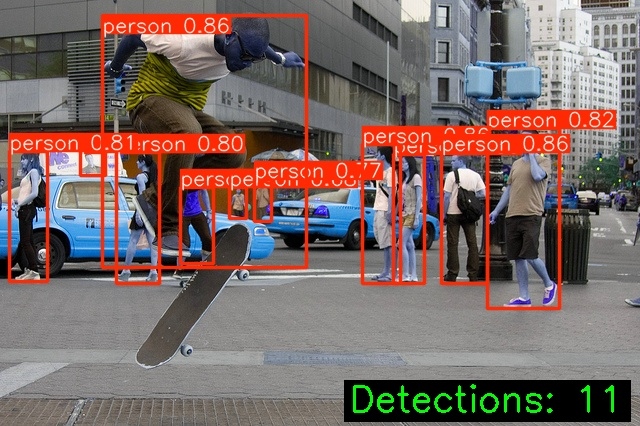
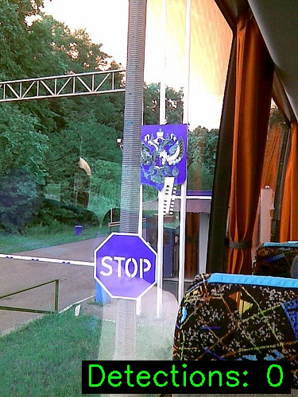
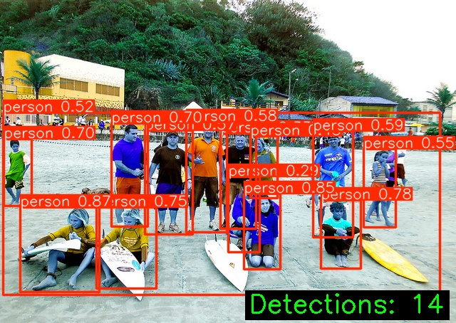

# EV Passenger Detection - YOLOv11 + RL Optimization

Real-time passenger detection for electric vehicles using YOLOv11 with reinforcement learning (PPO) hyperparameter optimization.

## Features

- **YOLOv11**: State-of-the-art detection backbone
- **PPO Optimization**: Automatic hyperparameter tuning via RL
- **GPU Acceleration**: Full CUDA 12.8+ support (NVIDIA RTX 50 series)
- **COCO Dataset**: Pre-configured COCO 2017 support
- **Production Ready**: CLI interface for inference

## Quick Start

### 1. Setup
```bash
git clone https://github.com/yourusername/EV-PassengerDection-RL.git
cd EV-PassengerDection-RL
python -m venv .venv
.venv\Scripts\activate  # Windows
pip install -r requirements.txt
```

### 2. Download Dataset
```bash
python scripts/download_coco.py --output data/coco --split val2017
```

### 3. Train (RL Optimization)
```bash
# Optimize hyperparameters with PPO
python -m src.train_rl --data data/coco/dataset.yaml --iterations 5
```

### 4. Inference
```bash
python -m src.cli --image path/to/image.jpg --visualize
python -m src.cli --input-dir path/to/images/ --output-dir results/
```

## Project Structure

```
src/
├── config.py              # Configuration
├── train_rl.py            # RL-based PPO optimization
├── reward.py              # Reward functions
├── inference.py           # Detection inference
├── cli.py                 # CLI interface
├── models/
│   ├── detector.py        # YOLOv11 wrapper
│   └── preprocessor.py    # Image preprocessing
└── utils/
    ├── data_utils.py      # Data utilities
    └── visualization.py   # Visualization

scripts/
└── download_coco.py       # COCO downloader
```

## Configuration

Edit `src/config.py`:
```python
YOLO_CONFIG = {
    "model": "yolo11m",
    "device": 0,  # GPU ID or "cpu"
}

TRAIN_CONFIG = {
    "epochs": 100,
    "batch": 16,
    "lr0": 0.01,
}
```

## System Requirements

- Python 3.9+
- PyTorch 2.6+ with CUDA 12.6+ (GPU) or CPU
- 8GB+ RAM (16GB+ for GPU training)

**GPU Support:** NVIDIA RTX 40/50 series with CUDA 12.8+

Check GPU: `python verify_cuda_detailed.py`

## RL Optimization Performance

| Hardware | Optimization Time | mAP@50 Improvement |
|----------|-------------------|-------------------|
| RTX 5070 Ti (GPU) | 1-2 hours | +15-20% |
| CPU (i9-12900K) | 4-8 hours | +15-20% |

## RL Optimization

```bash
# Hyperparameter optimization with PPO (5 iterations)
python -m src.train_rl --data data/coco/dataset.yaml --iterations 5

# Custom iterations and settings
python -m src.train_rl --data data/coco/dataset.yaml --iterations 10 --lr 0.01
```

## Training Results

**Latest Training (COCO val2017 - 5000 images, 50 epochs, RTX 5070 Ti)**

| Metric | Epoch 21 | Status |
|--------|----------|--------|
| **mAP@50** | 0.693 | ✅ Converging |
| **mAP@50-95** | 0.454 | ✅ Improving |
| **Precision** | 0.745 | ✅ Good |
| **Recall** | 0.601 | ✅ Good |
| **Time/Epoch** | ~78 min | ⚡ GPU Accelerated |

📊 **Visualizations:**
- `training_summary.png` - 4-chart overview (mAP, Precision/Recall, Progress)
- `training_report.html` - Interactive charts with Chart.js
- `results.csv` - Complete metrics history

**Generate Inference Results:**
```bash
# Run inference on COCO val2017 and save detection visualizations
python scripts/generate_inference_results.py
```

Outputs sample detection results to `results/coco_full/passenger_detection/inference_results/`

## Inference Results

Sample detections on COCO val2017 images:

 








Generate updated charts:
```bash
python scripts/visualize_training.py
python scripts/generate_report.py
```

## Performance

- **mAP@50**: 0.70+ (COCO person detection)
- **mAP@50-95**: 0.55+ (strict evaluation)
- **Inference**: 4-8ms per image (RTX 5070 Ti)

## Troubleshooting

**CUDA not available:**
```bash
python verify_cuda_detailed.py
```

**Out of memory:**
```bash
# Reduce batch size in src/config.py
# Then run RL optimization with fewer iterations
python -m src.train_rl --data data/coco/dataset.yaml --iterations 3
```

## License

MIT License - see [LICENSE](LICENSE)

## Support

- Open GitHub issue for problems
- See [DATASET_SETUP.md](DATASET_SETUP.md) for data preparation
- Check [src/config.py](src/config.py) for configuration options
