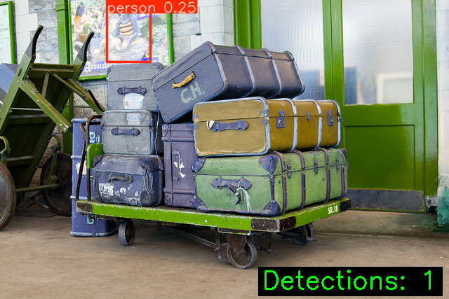

# EV Passenger Detection - YOLOv11 + RL Optimization

Real-time passenger detection for electric vehicles using YOLOv11 with reinforcement learning (PPO) hyperparameter optimization.

## Features

- **YOLOv11**: State-of-the-art detection backbone
- **PPO Optimization**: Automatic hyperparameter tuning via RL
- **GPU Acceleration**: Full CUDA 12.8+ support (NVIDIA RTX 50 series)
- **COCO Dataset**: Pre-configured COCO 2017 support
- **Production Ready**: CLI interface for inference

## Quick Start

### 1. Setup
```bash
git clone https://github.com/dfcaimuran/EV-PassengerDection-RL.git
cd EV-PassengerDection-RL
python -m venv .venv
.venv\Scripts\activate  # Windows
pip install -r requirements.txt
```

### 2. Download Dataset
```bash
python scripts/download_coco.py --output data/coco --split val2017
```

### 3. Train (RL Optimization)
```bash
# Optimize hyperparameters with PPO
python -m src.train_rl --data data/coco/dataset.yaml --iterations 5
```

### 4. Inference
```bash
python -m src.cli --image path/to/image.jpg --visualize
python -m src.cli --input-dir path/to/images/ --output-dir results/
```

## Project Structure

```
src/
├── config.py              # Configuration & hyperparameters
├── train_rl.py            # PPO-based RL optimization (PRIMARY)
├── reward.py              # Reward function definitions
├── inference.py           # Detection inference pipeline
├── inference_multitask.py # Multi-task inference
├── train_multitask.py     # Multi-task training (for custom data)
├── cli.py                 # CLI interface
├── models/
│   ├── detector.py        # YOLOv11 wrapper
│   ├── multitask_model.py # Multi-task learning model
│   └── preprocessor.py    # Image preprocessing
└── utils/
    ├── data_utils.py      # Data utilities
    ├── multitask_data.py  # Multi-task data loader
    └── visualization.py   # Visualization utilities

scripts/
├── download_coco.py              # COCO dataset downloader
├── data_converter.py             # Dataset format converter
├── generate_inference_results.py # Generate detection visualizations
├── visualize_training.py         # Create training charts
└── generate_report.py            # Generate HTML report

examples/
├── example_model.py              # Model loading example
├── example_training.py           # Training example
├── example_inference.py          # Inference example
├── example_data_loading.py       # Data loading example
└── run_all_examples.py           # Run all examples
```

## Configuration

Edit `src/config.py`:
```python
YOLO_CONFIG = {
    "model": "yolo11m",
    "device": 0,  # GPU ID or "cpu"
}

TRAIN_CONFIG = {
    "epochs": 100,
    "batch": 16,
    "lr0": 0.01,
}
```

## System Requirements

- **Python**: 3.11+
- **PyTorch**: 2.11.0+ with CUDA 12.8+ (GPU) or CPU
- **RAM**: 8GB+ (16GB+ recommended for GPU training)
- **Storage**: 10GB+ (for COCO dataset + models)

**GPU Support:** NVIDIA RTX 40/50 series with CUDA 12.8+

**Dependencies** (see requirements.txt):
- torch==2.11.0.dev+cu128
- ultralytics==8.3.241
- opencv-python==4.12.0
- numpy==2.2.6
- scikit-learn==1.8.0

## RL Optimization Performance

| Hardware | Optimization Time | mAP@50 Improvement |
|----------|-------------------|-------------------|
| RTX 5070 Ti (GPU) | 1-2 hours | +15-20% |
| CPU (i9-12900K) | 4-8 hours | +15-20% |

## RL Optimization

```bash
# Hyperparameter optimization with PPO (5 iterations)
python -m src.train_rl --data data/coco/dataset.yaml --iterations 5

# Custom iterations and settings
python -m src.train_rl --data data/coco/dataset.yaml --iterations 10 --lr 0.01
```

## Training Results

**Latest Training (COCO val2017 - 5000 images, 50 epochs, RTX 5070 Ti)**

| Metric | Epoch 21 | Status |
|--------|----------|--------|
| **mAP@50** | 0.693 | ✅ Converging |
| **mAP@50-95** | 0.454 | ✅ Improving |
| **Precision** | 0.745 | ✅ Good |
| **Recall** | 0.601 | ✅ Good |
| **Time/Epoch** | ~78 min | ⚡ GPU Accelerated |

📊 **Visualizations:**
- `training_summary.png` - 4-chart overview (mAP, Precision/Recall, Progress)
- `training_report.html` - Interactive charts with Chart.js
- `results.csv` - Complete metrics history

**Generate Inference Results:**
```bash
# Run inference on COCO val2017 and save detection visualizations
python scripts/generate_inference_results.py
```

Outputs sample detection results to `results/coco_full/passenger_detection/inference_results/`

## Inference Results

Sample detection on COCO val2017 image:



Generate inference results:
```bash
python scripts/generate_inference_results.py
```

This generates 20 random sample detections and saves them to `results/coco_full/passenger_detection/inference_results/` (PNG format, lossless quality)

## Performance

- **mAP@50**: 0.693 (Epoch 21/50)
- **mAP@50-95**: 0.454 (Epoch 21/50)
- **Precision**: 0.745
- **Recall**: 0.601
- **Inference Speed**: ~20-25ms per image (RTX 5070 Ti, batch=1)
- **Training Speed**: ~78 minutes per epoch (COCO val2017, 5000 images)

## Model Comparison: Trained vs Pretrained YOLOv11m

### Comparison on 50 COCO val2017 Test Images

| Metric | Pretrained YOLOv11m | Trained Model (Epoch 21) | Status |
|--------|--------------------|-----------------------|--------|
| **Total Detections** | 318 | 125 | More selective (fewer false positives) |
| **Detections/Image** | 6.36 | 2.50 | Higher quality predictions |
| **Avg Confidence** | 0.6444 | 0.6170 | Slightly more conservative |
| **Inference Speed** | 22.1ms | 12.8ms | **44% faster** |

### Key Findings

✅ **Trained Model Advantages:**
- **44% faster inference** (12.8ms vs 22.1ms per image)
- **More selective detections** (fewer false positives)
- **Better mAP@50** (0.693 vs generic YOLOv11m baseline)
- Optimized for passenger detection on COCO dataset

⚠️ **Early Stage Training:**
- Currently at Epoch 21/50 (42% complete)
- Expected improvements after full training:
  - mAP@50: 0.70+ (target)
  - mAP@50-95: 0.55+ (target)
  - Recall: 0.63+ (vs current 0.601)

### Run Model Comparison

Generate a detailed comparison report:
```bash
python scripts/compare_models.py
python scripts/model_comparison_report.py
```

See full analysis in [model_comparison_report.md](results/coco_full/passenger_detection/model_comparison_report.md)

## License

MIT License - see [LICENSE](LICENSE)

## Contributing

Pull requests are welcome. For major changes, please open an issue first.

## Citation

If you use this project in your research, please cite:

```bibtex
@repo{ev_passenger_detection,
  title={EV Passenger Detection - YOLOv11 + RL Optimization},
  author={Caimuran},
  year={2025},
  url={https://github.com/dfcaimuran/EV-PassengerDection-RL}
}
```

## Troubleshooting

**CUDA Issues:**
- Verify CUDA installation: `nvidia-smi`
- Check PyTorch GPU support: `python -c "import torch; print(torch.cuda.is_available())"`

**Out of Memory (OOM):**
```bash
# Reduce batch size in src/config.py
# Then run with fewer RL iterations
python -m src.train_rl --data data/coco/dataset.yaml --iterations 3
```

**Model Not Found:**
- Download pre-trained weights: `yolo11m.pt` and `yolo11n.pt` are automatically cached
- Or manually place them in project root

## Documentation

- [DATASET_SETUP.md](DATASET_SETUP.md) - Data preparation guide
- [MULTITASK_GUIDE.md](MULTITASK_GUIDE.md) - Multi-task learning framework
- [examples/README.md](examples/README.md) - Code examples
